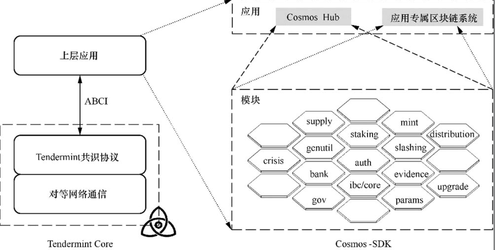
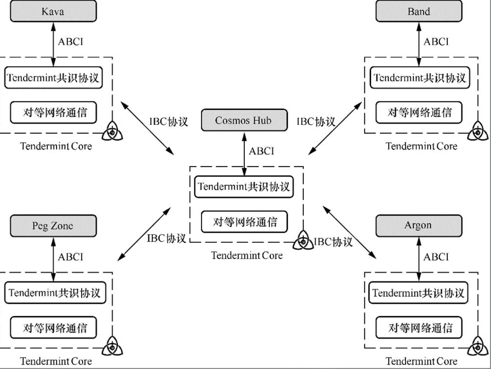

## 区块链现阶段的问题
> 本文内容主要来自《区块链架构与实现：Cosmos 详解》

### 开发周期长、技术门槛高

比特币网络面临这样的问题，以太坊的出现解决了这一类问题，主要是用 evm 虚拟机和智能合约开发 dapp 的形式来实现去中心化应用

### 资源消耗大、交易体验差

比特币和以太坊都面临这样的问题，主要是工作量证明（pow）、中本聪共识协议造成的。

解决办法：可以用权益证明(pos)来替代 pow，用拜占庭容错共识协议(bft)或者实用拜占庭容错（practical Byzantine fault tolerance，PBFT）共识协议来代替中本聪共识协议。

### 链上扩容难与跨链通信难

比如 eth 链上部署了大量的 dapp 应用，都在争抢有限的计算资源。bch 通过增大每个区块的容量来提高链上交易处理速度的方式仅能带来有限的速度提高，eth2.0 的分片来实现链上交易并行处理的方式开发难度大，进展缓慢。所以构建多条链，并且多链通信是一种不错的解决方式。

跨链通信的 3 种实现机制：散列锁、公证人和中继

## Cosmos 的解决方案

为每一个区块链应用单独构建一条区块链，使用 IBC 协议来连接所有的区块链，通过 Tendermint Core、Cosmos-SDK 提供了区块链应用的开发框架，自动继承 Tendermint 共识协议以及 PoS 机制

### Cosmos Hub

是第一个基于 Cosmos 构建的区块链，链上资产是 ATOM

### Tendermint Core

将区块链系统自下而上拆解为 3 层：对等网络通信层、共识协议层以及上层应用层。

1. 对等网络通信层：对等网络通信，确保交易、区块、共识协议的消息能够快速地在整个网络内广播。

2. 共识协议层：构建新的区块，并通过共识协议确保全网就区块内容（交易、上层应用状态等）达成共识。

3. 上层应用层：根据共识协议层构建的区块，通过 ABCI 与上层应用交互，执行区块中的交易并完成上层应用的状态更新

> Tendermint Core 中提供了对等网络通信层与共识协议层的实现，并抽象出区块链应用接口（application blockchain interface，ABCI）来完成共识协议层与上层应用层的互动。

使用的共识协议是 Tendermint 共识协议（pbft 共识协议改进而来）

### Cosmos-SDK

Tendermint 团队构建了 Cosmos-SDK，实现了区块链场景中一系列的通用功能模块

- 基础功能：账户管理与交易处理。
- auth 模块管理系统中的所有账户。
- bank 模块管理链上资产的转移。
- 辅助功能：创世区块管理、链上状态一致性检查等。
- genutil 模块管理链的创世区块。
- supply 模块负责链上资产总量的管理。
- crisis 模块负责所有模块的不变量检查的管理。
- params 模块负责所有模块的参数管理。
- 链上治理：基于提案的链上治理与网络升级。
- gov 模块负责链上治理机制。
- upgrade 模块负责链的升级。
- PoS：链上资产抵押、链上惩罚和奖励。
- staking 模块管理链上资产抵押。
- slashing 模块负责对验证者的被动作恶行为进行惩罚。
- evidence 模块负责对验证者的主动作恶行为进行惩罚。
- mint 模块负责链上资产的铸造。
- distribution 模块管理区块奖励的分发。
- IBC 协议：基于中继机制的跨链协议。
- ibc/core 模块负责跨链通信功能

### 基于 Tendermint Core 和 Cosmos-SDK 构建的区块链系统

### IBC 协议

IBC 协议是为了跨链而诞生的，是基于中继机制而实现的协议，原理是任意两个希望跨链通信的区块链可以依赖密码学证明技术向对方链证明自身链上发生了特定的事件。两条链之间的网络通信通过中继者（relayer）完成。

