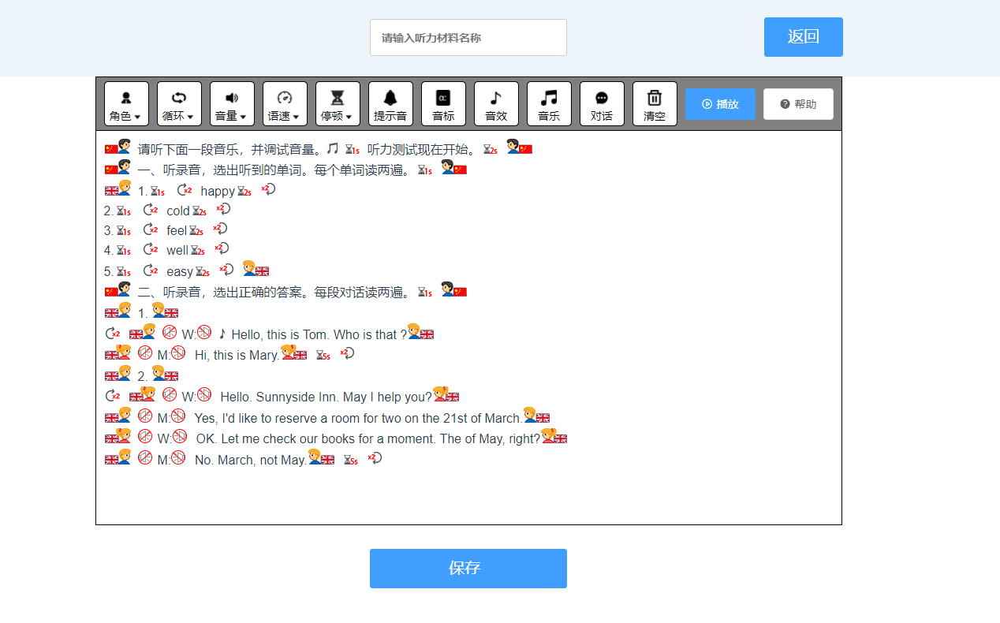
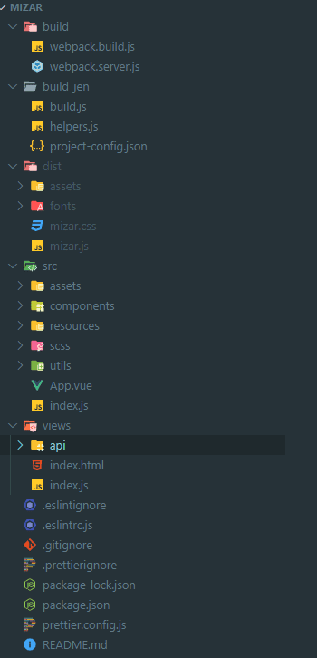
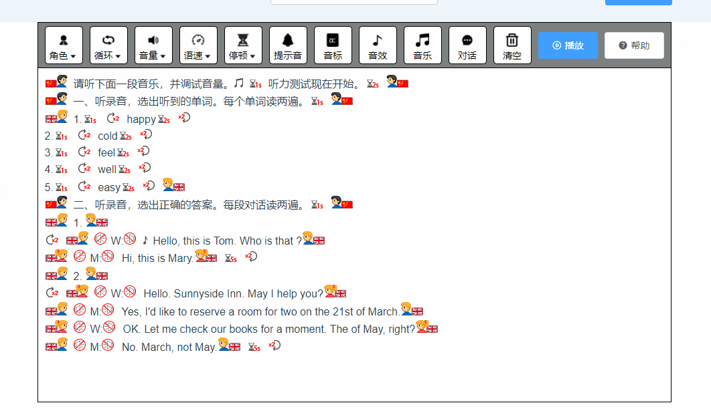
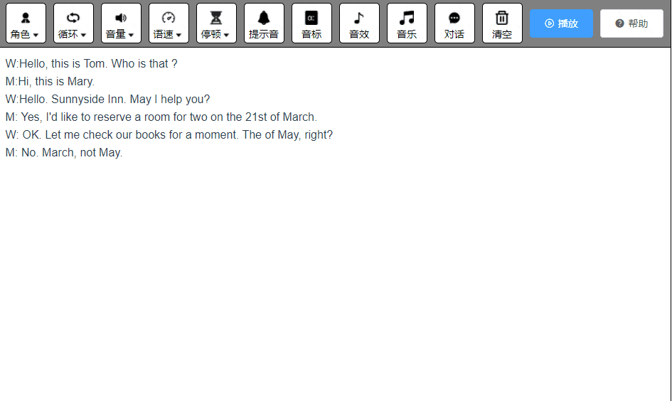

### 需求

> 背景：tts 老版代码是用 flash 写的，源码也找不到了。由于各大浏览器开始禁用 flash 功能，所以需要用 H5 重构
>
> tts 是什么：就是一个富文本编辑器，通过格式化编辑文本，调用后端文字转语音的接口生成听力材料并播放。

- 第一版要求功能的复制，并修复一些 bug
- 后续要求功能的优化，并增加一些功能
- 

### 技术选型

- 外围的界面由于 UI 简单故使用原生 JS 和 Css 编写。Mizar 在技术选型的时候，正是 Vue3 正在推广的时候，由于依赖关系比较单一，所以进行了 Vue3 的尝鲜。
- 考虑到 UI 组件比较多，所以使用了 ELEMENT-Plus（不用 Ant Design Vue（Less））
- 一开始使用 Vue-CLI 生成模板，后续因为几项 Bug，而且 VueCli 的黑箱机制，定位问题比较困难，所以参考 VueCli 的源码重写了一套模板配置。（由于文档不全，出了问题也找不到方案，最初是在 Vue form 里提问 然后有人帮解决的）
- 打包工具用的 webpack v5,项目里配置了 eslint 和 prettier 的规则，用的规范是 [alloy-config](https://github.com/AlloyTeam/eslint-config-alloy)。

### 方案

1. 为了保证外部调用，抽出编辑器部分 Mizar，并把接口调用都抛出来。外部 UI 放在 Proxima，通过 UMD 的形式调用 Mizar。

2. 编辑区域实际就是一个富文本编辑器，因为有标签的存在，所以不能用 textArea。参考了一些主流的富文本编辑器的实现，选用

```html
contenteditable="true"
```

3. 编辑器需要获取选区，使用浏览器的 selection api。
4. 编辑器需要插入和删除 dom，使用浏览器的 range.insert 和 range.deleteContents api 。

### 项目结构



### 核心功能的实现

#### 鼠标光标的缓存

> 在编辑器里，鼠标选择内容后，并不会立即插入标签，后续会点击弹窗、下拉框，在点击的时候就会导致 selection 对象改变。当用户拖选内容的时候，如果鼠标脱离编辑器，那此时的 selection 对象就会是空。如果用户用键盘操作光标，selection 对象不会更新。

**参考了一些开源文本编辑器的实现，这里都是做了光标缓存的处理。slection 事件触发的时候，记录用户单击或者拖选的 selection。监听鼠标离开事件，离开时就记录离开时的 selection。监听键盘事件，重置 selection**

#### 内容校验

> 内容校验有 3 个入口：初始化页面，获取页面内容的时候；保存/播放的时候；粘贴内容的时候。

1. 初始化页面：由于由许多 flash 编辑的听力材料数据，所以需要把 falsh 的数据转换为 H5 支持的数据格式。目前的逻辑是，编辑器支持编辑老的数据，但是 h5 编辑器编辑过的数据，flash 版的编辑器就不再支持。这里过滤主要用正则白名单过滤，把 flash 的信息和一些样式属性，class，不支持的标签都过滤掉。匹配换行符和换行标签，还有块标签，根据标签分组，每一行都用 p 标签包裹。行内正则匹配文本（用没有<>的文字和符号），每一段文本都用 span 标签包裹，给图片标签都添加唯一标识。因为 flash 图片的 source 不能用于 H5,格式不一致，所以需要根据图片 id，查本地的表，获取图片 url。
2. 保存/播放：基本逻辑与初始化一致
3. 粘贴内容：如粘贴功能所述

#### 粘贴功能

> 线上的粘贴文本在粘贴 word 或者网页的时候会有 bug。
>
> 此处编辑器 H5 的实现是用了 contenteditable,所以理论上是可以粘贴 html。如果不禁止默认粘贴事件，那么编辑器内可以粘贴任意来源会被存到剪贴板的内容。但由于接口生成音频需要匹配对应的 html 格式，同时不能带有白名单之外的内容，所以必须做内容过滤。

- 粘贴功能第一版做了简单的处理，粘贴的时候只粘贴纯文本。实现的方案就是判断文本有无换行，没有换行就插入`<span>`标签包裹的文本。有换行，就根据换行分组，分别插入`<p>`标签包裹的文本，每次插入后都会调用 range.collapse(false)收缩光标至插入内容之后（chrome56 以下不一致）。
- 由于会有许多在当前编辑器粘贴内容，或者是打开过去编辑的内容，粘贴到新的编辑器之类的需求。所以做了区分来源的处理，剪贴板无法直接判断来源，但可以根据内容来判断来源。我会根据标签的 id 来判断，只要有不是我 id 的内容，就会被当作纯文本粘贴。都是我 id 的内容，会被当作 html 粘贴。
- 用户在当前位置粘贴，还是选择内容后粘贴，这里做了处理。如果是选择内容，会调用 deleteContents 方法删除内容后，再插入标签。最后会调用 selection.collapseToEnd 收缩光标至末尾。

#### 标签错误提示闪烁

> 需求是有标签缺失或者错位的时候，需要闪烁提示错误的标签



1. 标签错误提示这里，有两种提示的方式。一种是用户编辑的时候提示，一种是用户播放/保存的时候提示。这里使用的是第二种。

2. 错误检测这里，使用的方法是用 selection api 先获取要检测内容的 html 字符串，为了定位错误标签，给所有的标签都加上了 guid 唯一标识。（这里第一版做的时候，单标签插入的是唯一标识，双标签插入的是相同的标识，错误检测的时候检测到双标签标识的缺失非常容易。但会有一个问题，当检测出错误标签后，用户不删除当前错误标签，选择插入一对相同的标签，再删除新增的那项。由于这对标签不是同时生成，故 guid 不同，导致错误检测出 bug）

   目前用的是一个栈的思想，维护一个错误栈和一个左栈，遇到一个左标签就 push 进栈，遇到一个右标签就比较最后一个元素，如果不匹配，把右标签 push 进错误栈，如果匹配，左标签 pop 出栈，最后把剩余的左栈加入错误栈，所有元素就是错误的项。

#### 音频播放

> 音频播放这里，会有播放单个音频和顺序播放音频数组的情况，接口为了减少单词请求量，把请求数据按 p 标签分组。

自己封装了 ttsAudio

> 播放音频数组，每一段音频结束后都会有 0.5s 左右的暂停时间，这段时间并没有在音频里生成。所以需要前端手动暂停，前端用的 setTimeOut 实现的暂停。
>
> 这里会有一个问题就是，播放音频数组，当一段音频刚好结束，用户点击播放暂停，去调用 audio.pause()方法会失效。

这里解决的办法是，调用暂停的时候就判断是播放时暂停，还是结束时暂停。如果是播放时暂停就正常暂停，后续可以续播。如果是一段结束时暂停，每段播放结束，数组就 shift，暂停时就清除掉 audio 对象，续播时新建 audio 播放剩余数组

#### 插入标签

> 插入标签分为 3 种，插入单标签，插入双标签，插入对话标签



这里做了选择内容的校验：

1. 如果用户鼠标是光标聚焦状态，此时可以仅可以在光标位置插入单标签，其余会给弹窗提示
2. 如果用户选择了内容，且内容不是对话的格式，此时仅可以在选择内容两端插入双标签，其余项置灰不可点击（还有根据选择内容的中英文，过滤插入标签的选择项）
3. 如果用户选择了内容，且是对话的格式，此时可以插入双标签，也可以插入对话标签

**插入标签这里，有两种方案，第一种是 document.execCommand，另一种是操作字符串。**

比较简单的方式肯定是操作字符串，但是初期调研的时候。苦于修改字符串后对位替换会有各种 bug...(sel 对象获取的 Html string 于 innnderHtml 获取的不一致，会有标签缺失（最后一个 br），字符转义 nbsp;...)

所以初期都使用了 document.execCommand 插入标签，这也是许多富文本编辑器使用的方式，但是在插入对话标签的时候会有问题 [selection.modify](https://developer.mozilla.org/en-US/docs/Web/API/Selection/modify)

因为会有一个人一次性说多句话导致换行的情况，modify api 没有合适的参数，期间尝试用 extend character 去试探检测冒号，但是在许多边角情况出现了死循环，解决了许多边角情况，但因为输入的不确定性，所以处理很困难，期间出了许多 bug。

因为许多富文本编辑器并没有类似的，同时插入多行标签的情况，所以没有找到参考的代码，相关文章也很少。

后面在 github(app)刷到了一个项目，用了 range.deleteContents 方法删除了选中内容并在当前位置聚焦，跑通了方案二的逻辑。

所以目前插入单双标签用的方案一，插入对话标签用的方案二。

关于对话标签，有一个难点就是对话内容的检测，用什么来判断是一段话。因为会有多句话导致换行的情况，所以使用了:分割，:到非空的字符是人名，冒号后面一直到非空字符是句子。这样适配了出现换行的情况，但这样也会有一个问题就是，当对话内容里出现了冒号，比如 6：30，这种场景是比较高频的。

所以比较适中的方案就是，检测主动换行，只要主动换行，就算作一段。

调用 cloneContents 复制 fragment 对象，Fragment 是文档碎片，他不能当作普通的对象使用，可以用获取他的 innerHtml 字符串，再过滤一道。但最好的方式，就是新建一个空 div,然后使用 appendChild 录入当前 fragment，注意使用后的 fragment 会被清空。

### 注意的点

- 为了减小包的体积，剔除了 Vue3,在 Proxima 里引用 Vue

- webpack 打包生产环境压缩 js 和 css 并自动删除注释

- sass-loder 用了 dart-sass，但是目前 dart-sass 配合 element-plus 使用的时候，会有图标样式缺失的情况（查看 issue 发现是 dart-sass 在编译的时候，默认会转换一遍 unicode 明文，会有双节字符乱码的情况）

  ```javascript
  对于图标编译之后，图标的content呈现乱码有dart-sass编译的原因，dart-sass编译时会将对应的unicode编码转换成对应unicode明文，所以通过伪元素来展示的图标如el-icon-arrow:before{ content: "\e6df"}，编译之后就变成了el-icon-arrow:before{ content: ""}，“”便是一个双字节字符
  正常情况我们会在meta标签上设置：<meta charset="utf-8" >，但这只对HTML内容解析有效，对于css内容中(外部样式表下)的双字节字符（如中文）解析并没有作用的，所以如果浏览器请求回来的css资源的HTTP响应头里的Content-Type未指明"charset=utf-8"的话，浏览器根据自身的嗅探机制来决定采用哪一种编码解析，结果就会概率出现双字节字符乱码的情况
  解决方案：
  1、使用 @charset
  2、使用 css-unicode-loader
  ```

- 项目里 Vue3 的写法，我用了 setup 和 methods 组合的写法，官方更推荐都写进 setup 里，我为了好看一点，把 methods 单独拿出来放在了外面，主要是单文件的东西有点太多了，都放在 setup 里比较长。

- 根组件只有一个 APP，子组件有 3 个 Alert、Button、SecondAlert。这里有一些可以优化的地方，比如 App 和 Alert 的代码就比较长（不算样式文件 APP 超过 1600 行，Alert 超过 1000 行）。这里算是有一些历史原因，最初想把弹窗 Alert 封装成 vue 方法，通过 this.$alert直接调用，这样调用起来比较简洁。但是后续书写发现，弹窗代码和组件代码有许多逻辑耦合，方法于组件的通信比较困难，没有直接的方式，只能通过外部封装方法类的时候手动传入。所以把封装的方法挪出来当成了components，后续把一些代码拆到了SecondAlert，减少了一些代码量。APP根组件里可以把一些methods封装成全局方法，通过this.$method 调用，一些过滤方法，在 proxima 里也有重复的代码，可以提出来封装到导出的 mizar 类里，也可以减少一些代码量。
