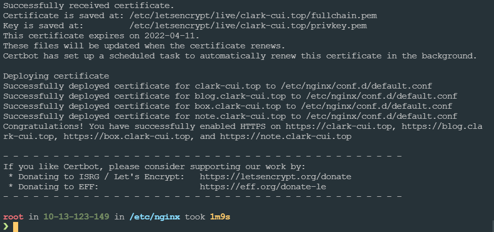

## 背景

今天早上耍着手机，去 github 看了下我的仓库，点击博客地址打开发现竟然是空的，这可吓坏我了。重新试了几次发现还是一样的，把地址粘贴到浏览器打开就好使。查了下资料，原因是 github app 强制 https，而我的网站还是 http 的... 好吧，许久之前埋下的坑，就今天来填吧...

### 现状

服务器是买的 Ucloud 的，没啥，就是便宜。之前的建站过程中，我分了 4 个块，主站，blog 站，note 站，box 站，note 和 box 都是一个默认的 html，主站用 threejs 跑了个 demo,博客站用的 vuepress-reco 主题构建的。

时间长了以后，主站被我废弃了，前段时间萌生了自己写个博客站的想法，说干就干，然后博客站就是主站了，不再做区分。

> 最近有一些观察和思考。有些人的主站就是为了炫，做的特别酷，过段时间更新一下。有些人就干脆把主站当大杂烩，博客笔记啥的都在上面，比如 vuepress。对我来说，我还是比较喜欢把博客当主站，用一个 home page 的自我介绍就当作主页了，在这里可以外挂笔记站和玩具站。后续笔记站会用 Logseq Publish 构建，玩具站大概会放些 demo 工具之类的。

在我肝了几天把新的博客站（主站）更新了出来后发生了今早的问题。

## 开干

### 目标

主域名(clark-cui.top) 与子域名(blog.clark-cui.top, note.clark-cui.top,box.clark-cui.top)均开启 https

### 方案

毫无疑问，肯定是 let's encrypt。国内一些云服务厂商有代处理的业务，但是基本都收费，价格不菲...然而看起来他们也是用的 let's encrypt。一番查阅后，决定使用自动化工具 cerbot，到期自动续，看起来很不错，试一试把

### 问题

服务器里之前建站的时候，http 服务器是用的 docker 的 nginx 镜像构建的，然而 cerbot 的 docker Image 看起来已经好久没更新了...也没啥人这么用。我尝试了一下，每输一个命令，就会报一个新的错...吓坏我了...我这个 docker 菜鸟在容器里折腾了半天，决定放弃了...能力不够，还是老实按照官网来

这也应征了那句话“Less is more”，搞不懂我当初就一个 Nginx，为啥还要装个 docker 装逼...

然后安装 nginx，还会跟 docker 里的有端口冲突，在把容器和镜像都删干净之后，几行命令装好 nginx

```bash
sudo yum install nginx
sudo systemctl enable nginx
sudo systemctl start nginx
sudo systemctl status nginx //检查其运行状态
```

装好的 nginx 程序目录在/etc/nginx，把之前 docker 里配过的 default.conf 粘过来即可。域文档的目录在/usr/local/src

然后是安装 cerbot,cerbot 的官网推荐先安装 snapd，再用 snapd 安装 cerbot。[官方文档安装 cerbot](https://certbot.eff.org/instructions?ws=nginx&os=centosrhel8)

然而我在`sudo snap install core; sudo snap refresh core`那里卡住了，死活过不去。

重复提示这俩报错，跟死循环一样：

- `error: cannot communicate with server`

- `Job for snapd.service failed because the control process exited with error code`

全是 known issues，网上一堆解决办法...然而全都没用，去 cerbot 的 form 里找了找，也没啥用

这个时候，我想另辟蹊径，既然装不了 snapd，那我不装你总行了吧，找了找，cerbot 还真有 yum 包，名字叫`cerbot-nginx`，然而我一看更新时间，醉了...都啥时候的了，看来还是躲不开

既然是安装 snapd 的问题，那我重新安装不就行了，按照 windows 重启就好的思路，重装，重启，我甚至重启了服务器...然而问题依旧

思考了下，或许换个姿势装 snapd 就好了呢？然后 google 搜索 centsos 8 install snapd，还真找出几篇不一样的姿势

[官方文档安装 snapd](https://snapcraft.io/docs/installing-snap-on-centos)

解决问题:按照官网示例，但是有几点不同

1.  先升级 epel,`sudo dnf upgrade` ，然后发现 700 多 M，没事，忍着头皮升，再次输入，并加上 `--allowerasing`
2.  把`sudo yum install snapd`换成`sudo dnf install snapd `
3.  在 create a symbolic link 之后，如果`sudo snap install core; sudo snap refresh core`报错`error: too early for operation, device not yet seeded or device model not acknowledged`，就输入命令`sudo dnf reinstall snapd`重装一下

然后按照官网的示例接着装

最后能看到下面这张图


热泪盈眶啊，有没有...

## 总结

这次踩坑花了一下午时间，报错的时候去看日志，能看到错误的信息，但由于我不知道是啥，所以信息也没啥用，还得靠 Google,所以我还是得恶补一下操作系统的知识。

~~然后刚又发现了新问题，站点是 https 的，但我博客文章里的图片，之前上传到七牛云图床的时候，绑定的域名是 cdn.clark-cui.top，是 http 的...在 https 的站点里就不加载了....要搞的话，得把 cdn 的域名也弄成 https...我醉了。想了下，我之前搞的这个图床 cdn 使用率基本小于 1%，目前没需求那就是没用，我还是把原图扣出来吧。~~

Done,

Cheers!
